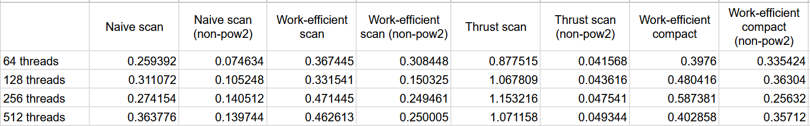
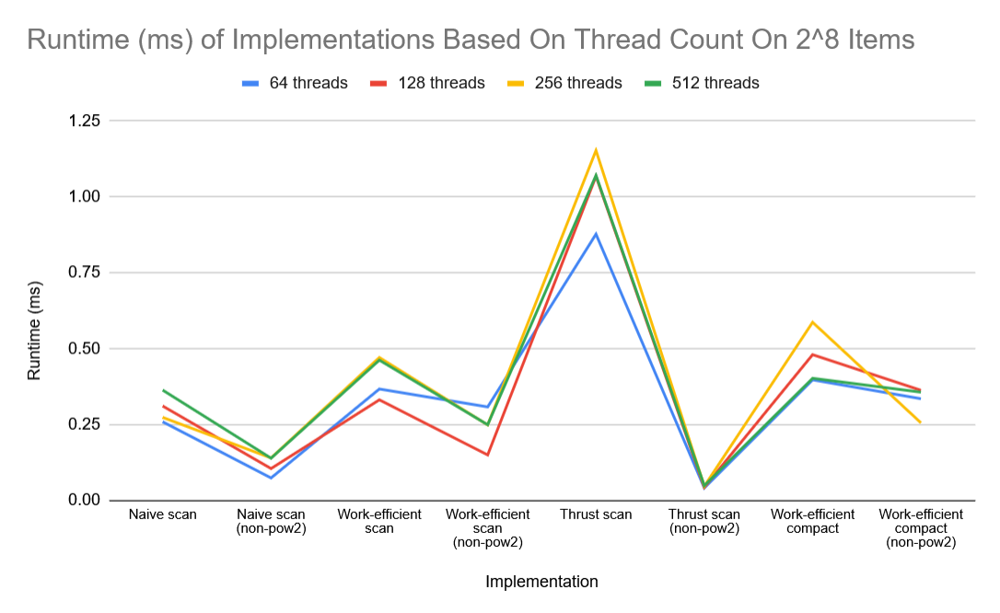

CUDA Stream Compaction
======================

**University of Pennsylvania, CIS 565: GPU Programming and Architecture, Project 2**

* Raymond Feng
  * [LinkedIn](https://www.linkedin.com/in/raymond-ma-feng/), [personal website](https://www.rfeng.dev/)
* Tested on: Windows 11, i9-9900KF @ 3.60GHz 32GB, NVIDIA GeForce RTX 2070 SUPER (Personal Computer)

This project implements the all-prefix sums scan algorithm on the CPU, a naive version on the GPU, a work-efficient version on the GPU, and an implementation using the thrust library. It also implements work-efficient parallel stream compaction.

## Project Description

### CPU Scan
A sequential, O(n) scan on the CPU was first implemented. This is pretty trivial, looping through every item of the array and adding the previously summed number to the element at the current index.

### Naive GPU Scan
A O(log2(n)) parallel scan was implemented on the GPU. For each "layer" of the scan, we increase the gaps between the items to be added. For cases where N was not a power of two, the length of the array was extended to the next power of two.

### Work-Efficient GPU Scan and Stream Compaction
An O(n) work-efficient scan algorithm was also implemented on the GPU. This involves treating the array as a balanced binary tree, and performing an upsweep parallel reduction, then a downsweep to traverse back down the partial sums, performing the scan in place. 
Like with the Naive GPU scan, the array was extended for arrays where N was not a power of two.

Similarly, a parallel compaction algorithm was also implemented in three steps: First, computing a true/false array. Second, running an exclusive scan on the true/false array. Then, scattering the result using a custom scatter function. All three steps run in parallel, giving us a time complexity of O(n).

### Thrust Scan
Using the thrust library provided with the base files, another scan algorithm was also implemented. This involved converting the input and output to thrust_vectors, and simply running thrust::exclusive_scan on them. 

## Performance Analysis

### Block Size
I tested various block sizes, ranging from 64 threads, to 128, to 256, and 512. Each of these tests was run on an array size of 2^8 items. As you can see, there's not much of a difference in runtime between them. I decided to use a block size of 128 threads for the rest of my tests.



### Naive GPU Scan

### Work-Efficient Scan

### Work-Efficient Stream Compaction

### Thrust

## Output
A sample of my output. N=2^8.

```
****************
** SCAN TESTS **
****************
    [   8  28  26  35   8  29   6  13   3  36  31  18  45 ...  33   0 ]
==== cpu scan, power-of-two ====
   elapsed time: 0.0004ms    (std::chrono Measured)
    [   0   8  36  62  97 105 134 140 153 156 192 223 241 ... 6044 6077 ]
==== cpu scan, non-power-of-two ====
   elapsed time: 0.0004ms    (std::chrono Measured)
    [   0   8  36  62  97 105 134 140 153 156 192 223 241 ... 5968 5977 ]
    passed
==== naive scan, power-of-two ====
   elapsed time: 0.385344ms    (CUDA Measured)
    passed
==== naive scan, non-power-of-two ====
   elapsed time: 0.07872ms    (CUDA Measured)
    passed
==== work-efficient scan, power-of-two ====
   elapsed time: 0.464288ms    (CUDA Measured)
    passed
==== work-efficient scan, non-power-of-two ====
   elapsed time: 0.151552ms    (CUDA Measured)
    passed
==== thrust scan, power-of-two ====
   elapsed time: 0.862272ms    (CUDA Measured)
    passed
==== thrust scan, non-power-of-two ====
   elapsed time: 0.03824ms    (CUDA Measured)
    passed

*****************************
** STREAM COMPACTION TESTS **
*****************************
    [   2   2   0   3   0   3   2   3   1   0   3   0   3 ...   3   0 ]
==== cpu compact without scan, power-of-two ====
   elapsed time: 0.0004ms    (std::chrono Measured)
    [   2   2   3   3   2   3   1   3   3   3   3   2   1 ...   1   1 ]
    passed
==== cpu compact without scan, non-power-of-two ====
   elapsed time: 0.0004ms    (std::chrono Measured)
    [   2   2   3   3   2   3   1   3   3   3   3   2   1 ...   2   1 ]
    passed
==== cpu compact with scan ====
   elapsed time: 0.0018ms    (std::chrono Measured)
    [   2   2   3   3   2   3   1   3   3   3   3   2   1 ...   1   1 ]
    passed
==== work-efficient compact, power-of-two ====
   elapsed time: 0.464704ms    (CUDA Measured)
    passed
==== work-efficient compact, non-power-of-two ====
   elapsed time: 0.15792ms    (CUDA Measured)
    passed```
